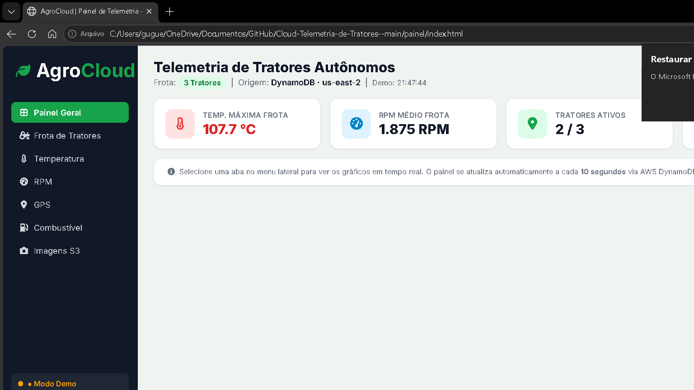

<div align="center">


<br/>

[](https://python.org)
[](https://aws.amazon.com/)
[](https://aws.amazon.com/dynamodb/)
[](https://aws.amazon.com/s3/)
[](https://github.com/GuGMantellis/Cloud-Telemetria-de-Tratores-)
[](https://www.fatecbebedouro.edu.br/)

</div>

---

## 📸 Preview do Painel

<div align="center">
  
  <br/>
  <em>Painel de monitoramento em tempo real — localização GPS, telemetria do motor e status da frota</em>
</div>

---

## 🌾 Sobre o Projeto

O **AgroCloud** é um sistema de **telemetria agrícola em nuvem** desenvolvido para a disciplina de Arquiteturas Cloud na FATEC Bebedouro. Simula e monitora frotas de tratores agrícolas em tempo real, enviando dados de motor, GPS e imagens de câmeras/drones diretamente para serviços da **Amazon Web Services**.

> 💡 **Problema real:** Fazendas com frotas grandes perdem eficiência por falta de visibilidade sobre os equipamentos em campo. Este projeto demonstra como resolver isso com cloud computing.

---

## ✨ Funcionalidades

| Feature | Descrição |
|---|---|
| 🗺️ **Mapa em Tempo Real** | Localização GPS dos tratores atualizada a cada 5s |
| ⚙️ **Telemetria do Motor** | RPM, temperatura do motor, nível de combustível |
| 📸 **Upload de Imagens** | Fotos de drones e câmeras de campo enviadas ao S3 |
| 📊 **Histórico** | Dados persistidos no DynamoDB com consulta por período |
| 🚨 **Alertas** | Notificações automáticas para anomalias detectadas |
| 🔌 **Modo Demo** | Painel funciona com dados locais quando offline |

---

## ☁️ Arquitetura AWS

```
┌──────────────────────────────────────────────────────────────┐
│                    EDGE (No Trator)                          │
│  [Sensor GPS] ──┐                                           │
│  [Motor RPM]  ──►  [Script Python] ──► HTTP/S ──► Internet  │
│  [Câmera]     ──┘       (Boto3)                             │
└──────────────────────────────────────────────────────────────┘
                              │
                ┌─────────────┼─────────────┐
                ▼             ▼             ▼
┌───────────────────┐  ┌──────────┐  ┌───────────┐
│   DynamoDB        │  │  AWS S3  │  │  EC2 /    │
│  (Telemetria      │  │ (Imagens │  │  Lambda   │
│   por Trator)     │  │  Drones) │  │ (Servidor)│
└───────────────────┘  └──────────┘  └───────────┘
                              │
                              ▼
┌──────────────────────────────────────────────────────────────┐
│                  FRONTEND (Painel Web)                        │
│  HTML/CSS/JS ── Leaflet.js (Mapa) ── Chart.js (Gráficos)    │
└──────────────────────────────────────────────────────────────┘
```

---

## 🛠️ Serviços AWS Utilizados

| Serviço | Para quê |
|---|---|
| **Amazon DynamoDB** | Banco NoSQL para armazenar telemetria em tempo real |
| **Amazon S3** | Armazenamento de imagens e vídeos de campo |
| **AWS EC2** | Servidor que recebe os dados dos tratores |
| **AWS IAM** | Controle de permissões e políticas de acesso |
| **Amazon CloudWatch** | Logs e monitoramento da infraestrutura |

---

## 📂 Estrutura do Projeto

```
📁 Cloud-Telemetria-de-Tratores/
├── 📁 edge/              ← Scripts que rodam no trator (Python)
│   └── enviar_telemetria.py
├── 📁 cloud/             ← Servidor e recebimento na nuvem
│   ├── servidor.py
│   └── Dockerfile
├── 📁 painel/            ← Dashboard web (HTML/CSS/JS)
│   ├── index.html
│   ├── style.css
│   └── app.js
├── 📁 infra/             ← Provisionamento da infra AWS
│   ├── provisionar_infra.py
│   └── iam_policy.json
├── 📁 utils/             ← Scripts auxiliares
├── 📁 docs/              ← Documentação e assets
└── README.md
```

---

## 🚀 Como Executar

### Pré-requisitos

- Python 3.9+
- Conta AWS com permissões para DynamoDB e S3
- AWS CLI configurado

### 1. Clone o repositório

```bash
git clone https://github.com/GuGMantellis/Cloud-Telemetria-de-Tratores-.git
cd Cloud-Telemetria-de-Tratores-
```

### 2. Instale as dependências

```bash
pip install boto3 awscli
```

### 3. Configure as credenciais AWS

> ⚠️ **NUNCA** adicione chaves diretamente no código!

```bash
aws configure
# AWS Access Key ID: [sua_key]
# AWS Secret Access Key: [sua_secret]
# Default region: us-east-1
```

### 4. Provisione a infraestrutura

```bash
python infra/provisionar_infra.py
```

Isso cria automaticamente as tabelas DynamoDB e o bucket S3.

### 5. Inicie os tratores virtuais

```bash
python edge/enviar_telemetria.py
```

### 6. Acesse o painel

Abra `painel/index.html` no navegador. Os dados aparecem em tempo real.
> Se o DynamoDB não estiver acessível, o painel entra automaticamente em **Modo Demo** com dados locais.

---

## 🔒 Segurança

- Credenciais configuradas via **variáveis de ambiente** ou **AWS CLI**
- IAM Role com **permissão mínima** (Scan/Query only) para o frontend
- Security Groups configurados para bloquear acesso não autorizado
- Nenhuma chave de acesso commitada no repositório

---

## 📊 Resultados

- ✅ Latência média de envio: **< 2 segundos**
- ✅ Suporte a múltiplos tratores simultâneos
- ✅ Histórico consultável por trator e período
- ✅ Painel responsivo (desktop e mobile)

---

<div align="center">

Desenvolvido por [Gustavo Mantellis](https://github.com/GuGMantellis) — FATEC Bebedouro 🎓

*Arquiteturas Cloud — 2024*

[](https://www.linkedin.com/in/gustavo-guedes-mantellis)


</div>
