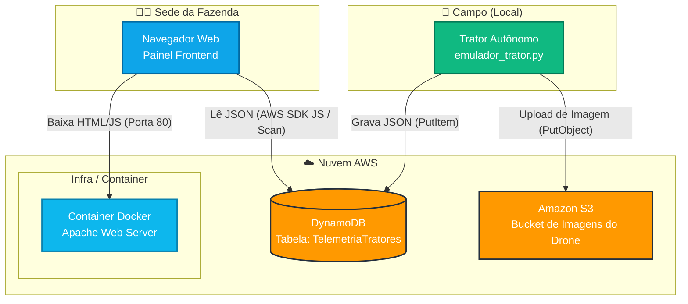

# Relatório e Infraestrutura AWS: Telemetria de Tratores

Este documento contém o diagrama de arquitetura do sistema e as instruções necessárias para replicar essa infraestrutura na AWS, refletindo as melhorias recentes para conectar o painel web diretamente com os dados reais usando a Nuvem.

## Diagrama de Arquitetura (Serverless Web App)

O diagrama abaixo ilustra a nova arquitetura, onde o frontend utiliza o AWS SDK for JavaScript para ler os dados reais do DynamoDB:



---

## Passo a Passo para Configuração na AWS

### 1. Amazon DynamoDB (Banco de Dados NoSQL)
Para armazenar os dados aninhados e dinâmicos enviados pelo Python:
1. Vá até o console do **DynamoDB** e clique em "Criar tabela".
2. **Nome da tabela**: `TelemetriaTratores`
3. **Chave de partição (Partition key)**: `id_trator` (Tipo: String)
4. Deixe as configurações no padrão e crie a tabela.
5. Em "Configurações de CORS" ou se usar API, certifique-se de que não haja bloqueio se for usar credenciais de Identity Pool, mas no nosso caso de uso educacional usaremos credenciais IAM diretas.

### 2. Amazon S3 (Armazenamento de Objetos)
Para armazenar as imagens brutas dos drones enviadas pelo Python:
1. Vá ao console do **S3** e clique em "Criar bucket".
2. **Nome do bucket**: `projeto-trator-[SEU-NOME-AQUI]` (deve ser único no mundo).
3. Ajuste o nome correspondente dentro do arquivo `emulador_trator.py`.

### 3. Segurança e IAM (Identity and Access Management)

Para seguir o princípio de privilégio mínimo, precisamos de DOIS usuários IAM (ou Roles).

#### Usuário 1: Trator_Escritor (Para rodar o Python)
Crie uma **Política em Linha (Inline Policy)** com as seguintes permissões:
```json
{
    "Version": "2012-10-17",
    "Statement": [
        {
            "Effect": "Allow",
            "Action": [
                "dynamodb:PutItem"
            ],
            "Resource": "arn:aws:dynamodb:us-east-1:*:table/TelemetriaTratores"
        },
        {
            "Effect": "Allow",
            "Action": [
                "s3:PutObject"
            ],
            "Resource": "arn:aws:s3:::*/*"
        }
    ]
}
```
**NUNCA adicione `dynamodb:DeleteItem` ou `s3:DeleteObject`.** O trator só pode gravar, jamais apagar histórico.

#### Usuário 2: Painel_Leitor (Para o Frontend JavaScript)
Crie um usuário/política apenas para o JavaScript ler a tabela:
```json
{
    "Version": "2012-10-17",
    "Statement": [
        {
            "Effect": "Allow",
            "Action": [
                "dynamodb:Scan",
                "dynamodb:Query",
                "dynamodb:GetItem"
            ],
            "Resource": "arn:aws:dynamodb:us-east-1:*:table/TelemetriaTratores"
        }
    ]
}
```
Coloque as credenciais deste segundo usuário no arquivo `painel/config.js`.

*(Nota: Em produção, o uso correto é um Cognito Identity Pool para o front-end, mas a abordagem com IAM Key Read-Only é utilizada aqui por propósitos acadêmicos de prototipação).*

### 4. Amazon EC2 e Security Groups (Hospedagem Docker)
Para o painel web:
1. Vá ao console do **EC2** e crie uma instância (Amazon Linux ou Ubuntu).
2. Em **Security Group**, permita "Entrada" nas Portas HTTP (80) e SSH (22).
3. Conecte-se na EC2, faça upload do projeto e rode:
   - `docker build -t painel-agronomo .`
   - `docker run -d -p 80:80 painel-agronomo`
4. Acesse o IP Público da máquina e a página `index.html` servida conectará à AWS para exibir os gráficos.
